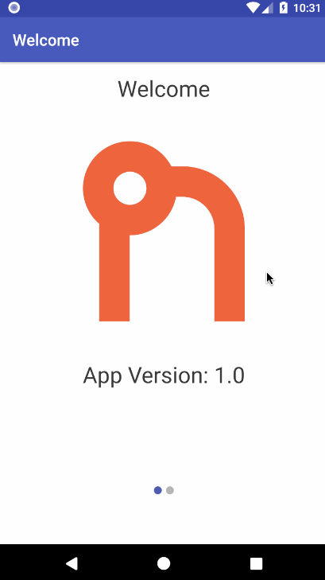

  

  <h3 align="center">Plain NativeScript TypeScript App Template from 
    <a href="https://nstudio.io">nStudio</a>
  </h3>

This is an opinionated project setup with multiple plugins added, code dropped in for easy use by using your own values.

The project contains many different helpers and utilities that we have encountered over the course of developing plain NativeScript apps and we believe this can be a great project to build production quality apps with when building with plain NativeScript.

### To use the template

`tns create my-app-name --template https://github.com/nstudio/template-nstudio-plain`

### App Welcome and Home Page

## Features

* Async/Await support

* Fonts

  * Material Icons
  * Ionicons

* Styling

  * Sass configured
  * Platform override files
  * Variables defined for flexibility within the app

* Screens

  * Home
  * Welcome (with onboarding slides)

* Utils
  * ObservableProperty() decorator for getter/setter props in an Observable
  * Keyboard methods to show/hide programmatically
  * Debounce method for simple debouncing without an extra dependency
  * EventListeners which allows you to pass an array of events on a page and bind them.
